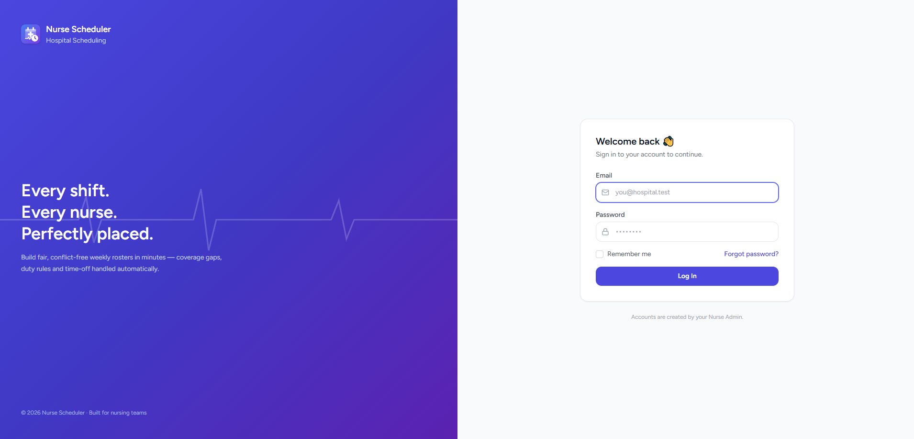
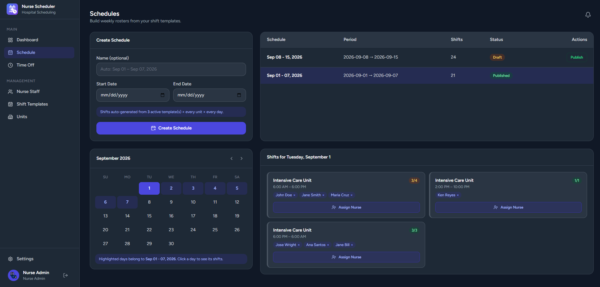

# 🏥 Nurse Scheduler

A modern hospital shift-scheduling system built with **Laravel + React (Inertia.js)** — designed to eliminate roster chaos with smart conflict detection, a full time-off approval workflow, and real-time notifications.


---

## ✨ Features

### 🛡️ For Nurse Admins
- **Smart Schedule Builder** — auto-generates weekly rosters from reusable shift templates × units × days
- **4 Safety Rules enforced on assignment:**
  1. One shift per nurse per day
  2. Max 3 consecutive duty days
  3. Weekly hour cap per contract (full-time / part-time / per-diem)
  4. Approved leave blocking
- **Live Coverage Snapshot** — see open slots per day before publishing
- **Draft → Publish workflow** — build privately, publish officially
- **Time-Off Review** — approve/reject with one click; decisions notify staff instantly
- **Nurse, Unit & Template management** with search, filters, sorting & pagination

### 👩‍️ For Nurse Staff
- **Personal Dashboard** — next shift, weekly hours, day-by-day week strip
- **Time-Off Requests** — 30-day advance rule + overlap protection
- **Real-time Notifications** — bell badge with approval/rejection alerts
- **Emoji Avatars** 🐼‍♀️ — because hospitals need joy too

### 🌗 Global
- **Night Mode** (persisted per browser)
- **Fully responsive** — tables transform into cards on mobile
- **Role-protected routes** (middleware + 403 guards)

---

## 🛠️ Tech Stack

| Layer      | Tech                                        |
| ---------- | ------------------------------------------- |
| Backend    | Laravel 12, PHP 8.3, Eloquent ORM           |
| Frontend   | React 19, TypeScript, Inertia.js            |
| Styling    | Tailwind CSS, Radix UI primitives, Lucide   |
| Database   | MySQL                                       |
| Tooling    | Vite, Laravel Herd, Ziggy (route helper)    |

---

## 🚀 Getting Started

### Requirements
- PHP ≥ 8.2, Composer
- Node ≥ 18, npm
- MySQL (or use Laravel Herd)

### Installation

```bash
git clone https://github.com/YOUR_USERNAME/YOUR_REPO.git
cd YOUR_REPO

composer install
npm install

cp .env.example .env
php artisan key:generate
# → set your DB credentials in .env

php artisan migrate --seed
npm run build          # or `npm run dev` for hot reload

php artisan serve      # or `herd` if using Laravel Herd
```

Open `http://localhost:8000` (or your Herd URL) 🎉

---

## 👤 Demo Accounts

Seeded by `php artisan migrate --seed`:

| Role        | Email                 | Password |
| ----------- | --------------------- | -------- |
| Nurse Admin | `admin@hospital.test` | `password` |
| Nurse Staff | `john.doe@hospital.test` | `password` |

*(See `database/seeders/DatabaseSeeder.php` for the full roster.)*

---

## 📸 Screenshots

<!-- Add a /screenshots folder to your repo, then uncomment & rename: -->
<!--  -->
<!--  -->
<!--  -->
<!--  -->

---

## 🧠 Code Style: Processing Hierarchy

Every Model, Controller & Middleware follows a numbered **Processing Hierarchy** doc-block convention for instant readability:

```php
/**************************************************************************/
/* Processing Hierarchy                                                   */
/**************************************************************************/
// index                         (1.0)  Display all schedules...
// store                         (2.0)  Create a new schedule...
```

---

## 🗺️ Project Structure Highlights

```
app/
├── Http/Controllers/Admin/     # Schedule, Nurse, Unit, Template, TimeOff
├── Models/                     # User, Shift, Schedule, TimeOffRequest...
└── Middleware/                 # EnsureUserIsNurseAdmin, HandleInertiaRequests
resources/js/
├── Pages/Admin/                # Schedules, Nurses, Units, Templates, TimeOff
├── Pages/                      # Dashboard, StaffDashboard, TimeOff, Profile
└── Components/ui/              # dialog, alert-dialog, select, time-picker
```

---

## 📄 License

MIT — free to use, learn from, and improve. 💙

---

Built with ❤️ and ☕ for every nurse who ever fought a paper roster.